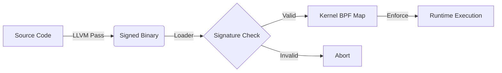

# Sentinel-CC: Policy-Carrying Code Enforcement

**Sentinel-CC** is a security architecture that enforces compile-time intent at runtime. It eliminates the semantic gap between "what the compiler sees" and "what the kernel executes" by embedding security policies directly into the binary and determining execution validity via a cryptographic trust chain.

> [!IMPORTANT]
> **Core Concept: Policy-Carrying Code (PCC)**
> Traditional security tools rely on external, manually maintained policy files. Sentinel-CC inverts this model:
> 1. **Compiler-Generated Policy:** The compiler (LLVM Pass) analyzes the Control Flow Graph (CFG) to generate a precise whitelist of valid syscalls.
> 2. **Embedded Trust:** This policy is embedded into a custom ELF section (`.sentinel`) and cryptographically bound to the code (`.text`) via an RSA-2048 signature.
> 3. **Kernel Enforcement:** The kernel (eBPF) refuses to execute any system call that does not match the signed policy.
> 
> 

## Architecture & Trust Chain

The system establishes a continuous chain of trust from source code to runtime execution.



* **Compiler:** Injects `.sentinel` policy and `.signature` placeholder.
* **Signer:** Offline tool signs `Hash(.text + .sentinel)` with RSA-2048.
* **Loader:** Verifies signature using **Linux Kernel Keyring** (Root of Trust).
* **Enforcer:** eBPF program validates `RIP` (Instruction Pointer) at every syscall.

## Repository Structure

This repository is organized into the core components of the trust chain:

```text
src/
├── compiler/       # LLVM Pass (The "Intention Extractor")
│   └── SentinelPass.cpp
├── kernel/         # eBPF Enforcer (The "Gatekeeper")
│   └── sentinel.bpf.c
└── runtime/        # Host Tools
    ├── loader.c    # Verifies signature & loads BPF
    └── sign_tool.c # RSA Signing Utility
tests/
├── victim.c            # Phase 1 test (inline syscalls)
├── victim_phase2.c     # Phase 2.1 test (shared library / ASLR)
├── victim_cfi.c        # Phase 2.2 test (Deep CFI caller validation)
├── victim_threaded.c   # Phase 2.3 test (multithreading)
└── policy_gen.py       # CFI policy extractor
```

## Building & Running

> [!NOTE]
> **Prerequisites**
> * **Clang/LLVM 15+**
> * **libbpf**, **libelf**, **libkeyutils**
> * **OpenSSL**
> 
> 

### 1. Build the System

```bash
make clean && make
```

This builds the Compiler Pass, the Runtime Tools, and compiles+signs all victim binaries.

### 2. Setup Root of Trust

Sentinel respects the Linux Kernel Keyring. You must load the public key into your session keyring before execution.

```bash
# In production, this would be a builtin_trusted_key
keyctl add user sentinel:pubkey "$(cat pub.pem)" @u

```

### 3. Run the Enforcer

```bash
sudo ./loader ./victim
```

**Expected Output:**

```text
[Loader] Signature Verified. Integrity Confirmed.
[Loader] Found 2 precise policy entries. Loading into Kernel...
[SAFE] Logging system active.

```

> [!CAUTION]
> **Security Validation (Tamper Test)**
> Attempting to modify the binary (even by a single byte) will break the cryptographic binding.
> ```bash
> echo -n "X" | dd of=victim bs=1 seek=500 count=1 conv=notrunc
> ./loader ./victim
> 
> ```
> 
> 
> **Output:** `[FATAL] Signature Verification FAILED! Binary may be tampered.`

## Project Status

> [!TIP]
> **Current Status: Phase 2 Complete**
> * **Phase 1:** Static Binary Enforcement with Cryptographic Binding.
> * **Phase 2:** Full Real-World Runtime Security (ASLR, Shared Libs, CFI).
> 
> 

### Phase 2.1: Shared Library Support (ASLR + Map-of-Maps)

Sentinel-CC supports dynamically linked binaries (e.g., `nginx`, `redis`) that use shared libraries (`libc.so`).

* **ASLR Handling:** The loader dynamically parses `/proc/PID/maps` to find randomization offsets.
* **Map-of-Maps:** Determines policy based on which module (Main Binary vs Libc) is executing.
* **Session Keyring:** Utilizes the session keyring for ephemeral, secure signature verification.

```bash
./verify_phase2.sh
```

### Phase 2.2: Deep CFI (Call-Stack Validation)

This enforces **Control Flow Integrity** by validating not just *where* a syscall happens, but *who called it*. It uses eBPF to walk the userspace call stack and validate that the return address falls within a compiler-declared valid caller range.

* **`cfi_policy` map:** Maps `syscall_offset → {caller_start, caller_end}`.
* **Stack Walking:** `bpf_get_stack(ctx, stack, sizeof(stack), BPF_F_USER_STACK)`.
* **Enforcement:** If caller RIP is outside the valid range, the process receives `SIGKILL`.

```bash
sudo ./loader ./victim_cfi
# Expected: [SAFE] prints, then unsafe_caller is killed by Sentinel.
```

### Phase 2.3: Multithreading Stability

Verified that TGID-based PID tracking correctly covers all threads in a process, preventing race conditions during policy enforcement.

```bash
sudo ./loader ./victim_threaded
# Expected: All 3 threads print successfully.
```
---

@Nevin Shine (System Security Student) 2026