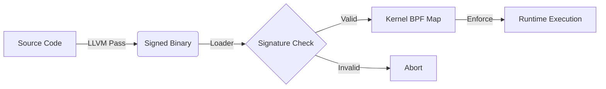

# Sentinel-CC: Policy-Carrying Code Enforcement

**Sentinel-CC** is a security architecture that enforces compile-time intent at runtime. It eliminates the gap between "what the compiler sees" and "what the kernel executes" by embedding security policies directly into the binary and determining execution validity via a cryptographic trust chain.

## 🧠 The Concept: Policy-Carrying Code (PCC)

Traditional security tools (like Seccomp or AppArmor) rely on external, manually maintained policy files. Sentinel-CC inverts this model:
1.  **Compiler-Generated Policy**: The compiler (LLVM Pass) analyzes the code and generates a precise list of valid system calls and their call sites.
2.  **Embedded Trust**: This policy is embedded into a custom ELF section (`.sentinel`) and cryptographically bound to the code (`.text`) via a digital signature.
3.  **Kernel Enforcement**: The kernel (eBPF) refuses to execute any system call that does not match the signed policy.

### The Trust Chain (Phase 1.4)


1.  **Compiler**: Injects `.sentinel` policy and `.signature` placeholder.
2.  **Signer**: Offline tool signs `Hash(.text + .sentinel)` with RSA-2048.
3.  **Loader**: Verifies signature using **Linux Kernel Keyring** (Root of Trust).
4.  **Enforcer**: eBPF program validates `RIP` (Instruction Pointer) at every syscall.

## 📂 Repository Structure

This repository is organized into the core components of the trust chain:

```
src/
├── compiler/       # LLVM Pass (The "Intention Extractor")
│   └── SentinelPass.cpp
├── kernel/         # eBPF Enforcer (The "Gatekeeper")
│   └── sentinel.bpf.c
└── runtime/        # Host Tools
    ├── loader.c    # Verifies signature & loads BPF
    └── sign_tool.c # RSA Signing Utility
tests/
├── victim.c        # Test program (The "Subject")
└── ...
```

## 🚀 Building & Running

### Prerequisites
-   **Clang/LLVM 15+**
-   **libbpf**, **libelf**, **libkeyutils**
-   **OpenSSL**

### 1. Build the System
```bash
make clean && make
```
This builds the Compiler Pass, the Runtime Tools, and compiles+signs the `victim` binary.

### 2. Setup Root of Trust
Sentinel respects the Linux Kernel Keyring. You must load the public key into your session keyring:
```bash
# In production, this would be a builtin_trusted_key
keyctl add user sentinel:pubkey "$(cat pub.pem)" @u
```

### 3. Run the Enforcer
```bash
sudo ./loader ./victim
```
Expected Output:
```text
[Loader] Signature Verified. Integrity Confirmed.
[Loader] Found 2 precise policy entries. Loading into Kernel...
[SAFE] Logging system active.
```

### 4. Verify Security (Tamper Test)
Try modifying the binary (even one byte!):
```bash
echo -n "X" | dd of=victim bs=1 seek=500 count=1 conv=notrunc
./loader ./victim
```
Output:
```text
[FATAL] Signature Verification FAILED! Binary may be tampered.
```

## 📜 Status
-   **Phase 1 (Complete)**: Static Binary Enforcement with Cryptographic Binding.
-   **Phase 2 (Complete)**: Shared Library Support (`libc.so`) with ASLR handling and Dynamic Map Updates.
-   **Phase 3 (Planned)**: Deep CFI & Multithreading.

## 🌟 Phase 2: Dynamic Enforcement (Real-World Apps)
Sentinel-CC now supports dynamically linked binaries (like `nginx`, `redis`) that use shared libraries (`libc.so`).

### Key Features
1.  **ASLR Handling**: The loader dynamically parses `/proc/PID/maps` to find randomization offsets.
2.  **Map-of-Maps**: Determining policy based on which module (Main Binary vs Libc) is executing.
3.  **Session Keyring**: Utilizing the session keyring for ephemeral, secure signature verification without root-global state.

### Verification (Phase 2)
To see Sentinel handle ASLR and enforce policy on `libc` calls, run the automated script:
```bash
./verify_phase2.sh
```
This script handles the complex Session Keyring setup and launches the `victim_phase2` binary.

## License
Research Prototype. MIT License.
