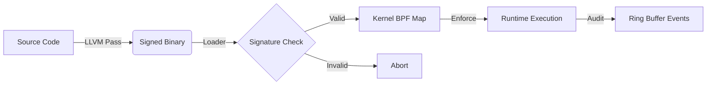

# Sentinel-CC: Policy-Carrying Code Enforcement

**Sentinel-CC** is a security architecture that enforces compile-time intent at runtime. It eliminates the semantic gap between "what the compiler sees" and "what the kernel executes" by embedding security policies directly into the binary and determining execution validity via a cryptographic trust chain.

> [!IMPORTANT]
> **Core Concept: Policy-Carrying Code (PCC)**
> Traditional security tools rely on external, manually maintained policy files. Sentinel-CC inverts this model:
> 1. **Compiler-Generated Policy:** The compiler (LLVM Pass) analyzes the CFG to generate a precise whitelist of valid syscalls, CFI ranges, and library import lists.
> 2. **Embedded Trust:** Policy (`.sentinel`), CFI metadata (`.sentinel_cfi`), and import tables (`.sentinel_imports`) are cryptographically bound to the code via an **Ed25519** signature.
> 3. **Kernel Enforcement:** 16 eBPF fentry hooks + fork tracking refuse any syscall that doesn't match the signed policy.
> 4. **Per-App Attack Surface Reduction:** Call-graph analysis through libc whitelists only the syscall sites *reachable* from the binary's actual imports — not the entire library.
> 
> 

## Architecture & Trust Chain

The system establishes a continuous chain of trust from source code to runtime execution.



* **Compiler:** Injects `.sentinel` policy, `.sentinel_cfi` caller-range metadata, `.sentinel_imports` (external function list), and `.signature` placeholder. Detects inline `syscall`, `int $0x80`, obfuscated `.byte 0x0f, 0x05`, and 50+ libc wrappers.
* **Signer:** Signs `Hash(.text + .sentinel + .sentinel_cfi + .sentinel_imports)` with **Ed25519**.
* **Loader:** Verifies signature (with key-revocation checks) via **Linux Kernel Keyring**, performs **call-graph BFS through libc** to whitelist only reachable syscall sites, loads generalized CFI from `.sentinel_cfi`, and populates BPF maps.
* **Enforcer:** eBPF programs validate `RIP` at every security-sensitive syscall across **16 fentry hooks + 1 fork tracepoint** (17 total).
* **Auditor:** 256 KB ring buffer streams structured enforcement events to userspace in real-time.

## Repository Structure

```text
src/
├── compiler/           # LLVM Pass (The "Intention Extractor")
│   └── SentinelPass.cpp
├── common/             # Shared Definitions
│   └── sentinel_shared.h
├── kernel/             # eBPF Enforcer (The "Gatekeeper")
│   └── sentinel.bpf.c
└── runtime/            # Host Tools
    ├── loader.c        # Sig verify, call-graph analysis, BPF loader
    ├── sentinel_dump.c # Policy inspector (reads .sentinel* sections)
    ├── sentinel_tui.c  # Terminal dashboard (live event visualization)
    └── sign_tool.c     # Ed25519 Signing Utility
tests/
├── victim.c            # Phase 1 test (inline syscalls)
├── victim_phase2.c     # Phase 2 test (shared library / ASLR)
├── victim_cfi.c        # Deep CFI test (caller validation)
├── victim_threaded.c   # Multithreading stability test
├── victim_fork.c       # Fork tracking test
├── victim_bench.c      # Syscall latency microbenchmark
├── attack_shellcode.c  # Red team: mmap RWX shellcode injection
├── attack_wxorx.c      # Red team: W^X mprotect violation
├── attack_rop.c        # Red team: ROP gadget reuse
├── attack_hidden_syscall.c  # Red team: syscall-number confusion
├── attack_ptrace.c     # Red team: ptrace injection
├── attack_memfd.c      # Red team: fileless malware (memfd_create)
├── attack_vm_writev.c  # Red team: cross-process write
├── attack_seccomp.c    # Red team: seccomp filter tampering
├── attack_sendmsg.c    # Red team: SCM_RIGHTS fd exfiltration
├── attack_dup2.c       # Red team: fd hijacking
├── run_all.sh          # Automated test suite
└── red_team.sh         # Adversarial attack suite
docs/
├── threat-model.md     # Threat model & attack scenarios
├── architecture.md     # System architecture deep-dive
└── api-reference.md    # Section formats, BPF maps, CLI reference
man/
├── sentinel-loader.1   # Man page for the runtime loader
├── sentinel-sign.1     # Man page for the signing tool
├── sentinel-dump.1     # Man page for the policy inspector
└── sentinel-tui.1      # Man page for the terminal dashboard
etc/
└── sentinel@.service   # systemd template unit for protecting binaries
Makefile                # Build system (30+ targets)
benchmark.sh            # Syscall latency + attack surface benchmark
```

## Building & Running

> [!NOTE]
> **Prerequisites**
> * **Clang/LLVM 15+**
> * **libbpf**, **libelf**, **libkeyutils**
> * **OpenSSL**
> * **bpftool**
> * Kernel with **BTF** support (`/sys/kernel/btf/vmlinux`)
> 
> 

### 1. Build the System

```bash
make clean && make
```

This builds the Compiler Pass, the Runtime Tools, and compiles+signs all victim binaries.

### 2. Setup Root of Trust

Sentinel respects the Linux Kernel Keyring. You must load the public key into your session keyring before execution.

```bash
# In production, this would be a builtin_trusted_key
sudo keyctl add user sentinel:pubkey "$(cat pub.pem)" @s
```

### 3. Run the Enforcer

```bash
sudo ./loader ./victim
```

**Expected Output:**

```text
[Loader] Signature Verified. Integrity Confirmed.
[Loader] Parsed 2 policy entries from .sentinel (text_vaddr=0x...)
[Loader] BPF programs loaded and attached.
[Loader] Policy loaded. Detaching child (PID=...).
[SAFE] Logging system active.
```

### 4. Run with Audit Mode

Stream real-time enforcement events:

```bash
sudo ./loader --audit ./victim
```

**Audit Output:**

```text
[Audit] ALLOW PID=1234 TID=1234 SYS=1 RIP=0x4014f0 Off=0x4f0 Mod=1
[Audit] BLOCK PID=1234 TID=1234 SYS=1 RIP=0x401530 Off=0x530 Mod=1
```

> [!CAUTION]
> **Security Validation (Tamper Test)**
> Attempting to modify the binary (even by a single byte) will break the Ed25519 cryptographic binding.
> ```bash
> echo -n "X" | dd of=victim bs=1 seek=500 count=1 conv=notrunc
> sudo ./loader ./victim
> ```
> **Output:** `[FATAL] Signature Verification FAILED! Binary may be tampered.`

## Features

### Multi-Syscall Enforcement

The eBPF enforcer hooks **16 security-sensitive syscalls** + 1 tracepoint (17 total):

| Hook | Syscall | NR | Purpose |
|------|---------|----|---------|
| `fentry/__x64_sys_write` | write | 1 | I/O enforcement |
| `fentry/__x64_sys_read` | read | 0 | I/O enforcement |
| `fentry/__x64_sys_openat` | openat | 257 | File access control |
| `fentry/__x64_sys_execve` | execve | 59 | Code injection prevention |
| `fentry/__x64_sys_mmap` | mmap | 9 | Memory mapping control |
| `fentry/__x64_sys_mprotect` | mprotect | 10 | W^X violation prevention |
| `fentry/__x64_sys_connect` | connect | 42 | Network policy |
| `fentry/__x64_sys_ptrace` | ptrace | 101 | Anti-debug (**unconditional block**) |
| `fentry/__x64_sys_memfd_create` | memfd_create | 319 | Fileless malware prevention |
| `fentry/__x64_sys_process_vm_writev` | process_vm_writev | 311 | Cross-process write (**unconditional block**) |
| `fentry/__x64_sys_prctl` | prctl | 157 | Process attribute control |
| `fentry/__x64_sys_sendmsg` | sendmsg | 46 | SCM_RIGHTS fd passing |
| `fentry/__x64_sys_dup2` | dup2 | 33 | File descriptor hijack |
| `fentry/__x64_sys_close` | close | 3 | Fd lifecycle control |
| `fentry/__x64_sys_ioctl` | ioctl | 16 | Device control |
| `fentry/__x64_sys_seccomp` | seccomp | 317 | Filter tampering (**unconditional block**) |
| `tp/sched/sched_process_fork` | fork | — | Child PID inheritance |

### Audit Ring Buffer

A 256KB ring buffer streams structured events (`audit_event`) to userspace in real-time. Each event contains: timestamp, PID, TID, syscall number, RIP, offset, module ID, and action (ALLOW/BLOCK/CFI_OK/CFI_FAIL).

#### JSON Audit Format (v4.1.0)

The loader supports JSON-formatted audit output with ISO-8601 timestamps, suitable for log aggregation pipelines:

```bash
sudo ./loader --audit --audit-format=json ./victim_phase2
```

```json
{"time":"2026-03-15T14:30:22.123456789Z","action":"ALLOW","pid":1234,"tid":1234,"syscall_nr":1,"rip":"0x4014f0","offset":"0x4f0","module":1}
```

#### Syslog Integration (v4.1.0)

Route enforcement events directly to the system log for centralized monitoring:

```bash
sudo ./loader --audit --audit-target=syslog ./victim_phase2
sudo ./loader --audit --audit-format=json --audit-target=syslog ./victim_phase2
```

Events are sent to LOG_DAEMON facility: BLOCK/CFI_FAIL/NR_MISMATCH at LOG_WARNING, ALLOW events at LOG_INFO.

### Policy Inspector (`sentinel-dump`)

Inspect the embedded Sentinel sections of any instrumented binary:

```bash
./sentinel-dump victim_phase2
```

```text
── .sentinel (Syscall Policy) ─────────────────────────────────
  Index  Site Address       Function           Offset     Syscall
  [  0]  0x00000000004004b7 0x00000000004004b0 0x000000f7 (any)
  [  1]  0x00000000004004c2 0x00000000004004b0 0x00000102 write (1)
  ...
  Total: 6 syscall site(s)

── .sentinel_imports (External Functions) ─────────────────────
  fclose              fopen               fprintf             printf
  Total: 6 import(s) (41 bytes)

── .signature ──────────────────────────────────────────────────
  Size: 64 bytes (Ed25519)
  Status: SIGNED
```

JSON output for tooling integration:

```bash
./sentinel-dump --json victim_phase2 | jq '.sentinel | length'
```

### Systemd Integration (v4.1.0)

A template service unit enables `systemctl`-managed binary protection:

```bash
sudo make install-systemd
sudo systemctl enable sentinel@-usr-local-bin-myserver
sudo systemctl start sentinel@-usr-local-bin-myserver
```

Events go to both the journal and syslog for unified log management.

### Post-Syscall Auditing (`--fexit`) (v4.2.0)

fexit BPF hooks emit the return value after the kernel completes key syscalls (write, read, openat, mmap, connect):

```bash
sudo ./loader --audit --fexit --audit-format=json ./victim_phase2
```

```json
{"ts":"2026-03-06T10:00:01.123Z","action":"FEXIT","pid":1234,"tid":1234,"syscall_nr":1,"ret":42}
```

Useful for observability without affecting enforcement.

### Policy Hot-Reload (`SIGHUP`) (v4.2.0)

Send SIGHUP to the loader to re-read the binary's `.sentinel` section and update BPF maps in-place — no child restart needed:

```bash
kill -HUP $(pidof sentinel-loader)
```

### LD_PRELOAD Sanitization (v4.2.0)

The loader detects and strips `LD_PRELOAD`, `LD_LIBRARY_PATH`, and `LD_AUDIT` from the child's environment before `fexecve()`. A warning is printed if any are detected.

### Terminal Dashboard (`sentinel-tui`) (v4.2.0)

Live TUI with aggregate counters, per-syscall breakdown, and color-coded event tail:

```bash
sudo ./loader --audit --audit-format=json ./victim_phase2 | ./sentinel-tui
```

### Multi-Arch CI (v4.2.0)

The CI pipeline now includes a Tier 3 ARM64 cross-compilation check that verifies the LLVM pass and BPF target work with `aarch64-linux-gnu`.

### Per-App Libc Filtering (Call-Graph Analysis)

The flagship v4.0.0 feature. Instead of whitelisting **all** ~435 syscall sites in glibc, Sentinel-CC now whitelists only those *reachable* from the binary's actual library calls.

1. The compiler emits `.sentinel_imports` — a null-terminated list of external functions the binary references (e.g., `fopen`, `printf`, `write`).
2. The loader builds a full symbol table of libc and loads its executable sections.
3. A **BFS** seeds from the imported symbols, scanning each function body for `E8` (relative CALL) opcodes, resolving targets to libc symbols, and recursing up to 24 levels deep.
4. Only syscall sites (`0f 05`) within *reachable* functions are whitelisted.

**Result:** A binary that calls 6 libc functions needs only 80 of the 435 syscall sites in glibc — an **81.6% attack surface reduction**.

```text
[Loader] Call-graph libc filtering: 6 imports → 618 reachable functions → 80 syscall sites
[Loader] Attack surface reduction: 80/435 libc sites whitelisted (81.6% reduction)
```

### Generalized CFI (`.sentinel_cfi` Section)

CFI policy is no longer hardcoded. The compiler emits a `.sentinel_cfi` section containing `{site_addr, func_addr}` pairs for every instrumented syscall site. The loader:
1. Reads `.sentinel_cfi` from the binary.
2. Looks up each function's size from the ELF symbol table.
3. Installs `cfi_policy` map entries: `offset → {func_start, func_end}`.

This makes CFI work automatically for any binary — no manual `policy_gen.py` needed.

### Obfuscated Syscall Detection

The compiler pass now detects attempts to hide syscall instructions inside inline assembly using `.byte` encoding:

```c
// All of these are now caught:
__asm__(".byte 0x0f, 0x05");           // hex
__asm__(".byte 15, 5");                 // decimal
__asm__("\x0f\x05");                    // escape sequences
```

Detected via regex analysis of inline asm strings. Emits a compile-time WARNING.

### Key Rotation & Revocation

```bash
make key-rotate    # Revoke current key → generate new keypair → re-sign all binaries
make key-revoke    # Revoke current key only (adds fingerprint to revocation list)
```

- Revoked keys are stored as SHA-256 fingerprints in `/etc/sentinel/revoked_keys`.
- The loader checks the revocation list before accepting any signature.
- Supports comments (`#`) in the revocation file.

### System-Wide Installation

```bash
sudo make install          # Installs sentinel-loader, sentinel-sign, sentinel-dump to /usr/local/bin
                           # Installs pub.pem to /etc/sentinel/
sudo make install-systemd  # Installs systemd template service unit
sudo make install-man      # Installs man pages
sudo make uninstall        # Removes installed files
```

### Dynamic `.sentinel` Parsing

The loader reads the binary's own embedded policy instead of hardcoding offsets. The `.sentinel` section contains an array of `{ void *site, void *function, int64_t syscall_nr }` entries that the compiler pass generated.

### Dynamic Libc Symbol Resolution

Instead of hardcoding offsets, the loader:
1. Finds the libc path from `/proc/PID/maps`
2. Opens libc's ELF and reads `.dynsym` + `.symtab`
3. Resolves `write`, `read`, `__write`, `__read`, etc. offsets dynamically

This works correctly across different glibc versions and distributions.

### Signal Handling & Cleanup

The loader installs `SIGINT`/`SIGTERM`/`SIGHUP` handlers that:
- Kill the child process gracefully
- Destroy BPF programs (freeing kernel resources)
- Exit with proper status codes

### Comprehensive Syscall Detection (Compiler Pass)

The LLVM pass detects **50+ syscall patterns** plus obfuscated encodings:
- Inline `syscall`, `int $0x80`, ARM `svc #0`
- `.byte 0x0f, 0x05` and `\x0f\x05` obfuscations
- All major POSIX wrappers: `read`, `write`, `open`, `close`, `mmap`, `mprotect`, `execve`, `fork`, `connect`, `bind`, `socket`, `ptrace`, ...
- GNU glibc internal wrappers: `__write`, `__libc_read`, `__sys_write`, ...

## Testing

### Automated Test Suite

```bash
sudo make test
```

This runs the full test suite including:
- **Prerequisite checks** (clang, bpftool, BTF, root)
- **ELF section integrity** (verifies .sentinel and .signature exist)
- **CLI tests** (`--help`, `--version`)
- **Signature verification** (valid binaries)
- **Tamper detection** (bit-flipped binary → rejection)
- **Unsigned binary rejection**
- **Phase 1/2/2.2/2.3 functional tests**

### Manual Tests

```bash
sudo ./loader ./victim              # Phase 1: Inline syscalls
sudo ./loader ./victim_phase2       # Phase 2: Shared libraries
sudo ./loader ./victim_cfi          # Phase 2.2: Deep CFI
sudo ./loader ./victim_threaded     # Phase 2.3: Multithreading
sudo ./loader --audit ./victim      # Any test with audit output
```

## Project Status

> [!TIP]
> **Current Status: v4.2.0 — fexit Hooks, Hot-Reload, TUI Dashboard, LD_PRELOAD Defense**
> * **Phase 1:** Static Binary Enforcement with Cryptographic Binding.
> * **Phase 2:** Full Real-World Runtime Security (ASLR, Shared Libs, CFI, Multithreading).
> * **Phase 3:** Syscall Number Binding + Fork Tracking + Ed25519 Migration.
> * **v4.0.0:** Per-app call-graph libc filtering (**81.6% attack surface reduction** measured), generalized CFI from `.sentinel_cfi`, obfuscated syscall detection, 16 hook points, key rotation/revocation, system-wide install.
> * **v4.1.0:** JSON audit format with ISO-8601 timestamps, syslog integration (LOG_DAEMON), `sentinel-dump` policy inspector (text + JSON), systemd template service unit, man pages for all tools.
> * **v4.2.0:** fexit post-syscall hooks (5 return-value probes), SIGHUP policy hot-reload, LD_PRELOAD/LD_AUDIT/LD_LIBRARY_PATH sanitization, `sentinel-tui` terminal dashboard, ARM64 cross-compilation CI tier.
> * **Performance:** 274 ns/syscall overhead (48.58%) — within wire-speed threshold.
> * **Security:** 12/12 red-team attacks blocked + fork tracking. 3 unconditional-block hooks (ptrace, process_vm_writev, seccomp).
> 
> 

### Benchmark Results

```text
═══════════════════════════════════════════════════
  Sentinel-CC Syscall Latency Benchmark
═══════════════════════════════════════════════════
  Native latency:     564 ns
  Enforced latency:   838 ns
  eBPF overhead:      274 ns/syscall (48.58%)
═══════════════════════════════════════════════════
  ✓ Overhead is within wire-speed threshold (< 500 ns).
```

The hot path (ALLOW) performs zero tracing/audit — only 3 BPF map lookups + 1 comparison. Security events (BLOCK/CFI_FAIL/NR_MISMATCH) still emit full audit + `bpf_printk` diagnostics.

```bash
sudo make bench    # Run the benchmark
```

### Red-Team Attack Suite

```bash
sudo make red-team
```

```text
  ┌────────────────────────────────────┬──────────────┬───────────┐
  │ Attack Vector                      │ Sentinel     │ Since     │
  ├────────────────────────────────────┼──────────────┼───────────┤
  │ Binary Tampering                   │ ✓ Blocked    │ v1.0.0    │
  │ Unsigned Binary                    │ ✓ Blocked    │ v1.0.0    │
  │ Shellcode Injection (mmap RWX)     │ ✓ Blocked    │ v2.0.0    │
  │ W^X Violation (mprotect)           │ ✓ Blocked    │ v2.0.0    │
  │ ROP Gadget Reuse                   │ ✓ With CFI   │ v2.0.0    │
  │ Syscall-Number Confusion           │ ✓ Blocked    │ v3.0.0    │
  │ Ptrace Injection                   │ ✓ Blocked    │ v3.0.0    │
  │ Fileless Malware (memfd_create)    │ ✓ Blocked    │ v3.0.0    │
  │ Cross-Process Write (vm_writev)    │ ✓ Blocked    │ v3.0.0    │
  │ Seccomp Filter Tampering           │ ✓ Blocked    │ v4.0.0    │
  │ FD Exfiltration (sendmsg)          │ ✓ Blocked    │ v4.0.0    │
  │ FD Hijacking (dup2)                │ ✓ Blocked    │ v4.0.0    │
  │ Fork Tracking                      │ ✓ Tracked    │ v3.0.0    │
  └────────────────────────────────────┴──────────────┴───────────┘
  All expected attacks were blocked! ✓
```

### Shared Library Support (ASLR + Map-of-Maps)

* **ASLR Handling:** The loader dynamically parses `/proc/PID/maps` to find randomization offsets.
* **Map-of-Maps:** Determines policy based on which module (Main Binary vs Libc) is executing.
* **Dynamic Resolution:** Libc symbol offsets resolved from the actual libc ELF on disk.
* **Per-App Filtering (v4.0.0):** If `.sentinel_imports` is present, only reachable libc syscall sites are whitelisted via call-graph BFS. Falls back to full-text scan for legacy binaries.
* **ld.so coverage:** Dynamic linker syscall sites whitelisted as libc-relative offsets.

### Deep CFI (Call-Stack Validation)

Enforces **Control Flow Integrity** by validating not just *where* a syscall happens, but *who called it*.

* **Generalized CFI (v4.0.0):** The compiler emits `.sentinel_cfi` with `{site, function}` pairs. The loader resolves function sizes from the ELF symbol table and loads `cfi_policy` automatically — no manual policy generation required.
* **`cfi_policy` map:** Maps `syscall_offset → {caller_start, caller_end}`.
* **Stack Walking:** `bpf_get_stack(ctx, stack, sizeof(stack), BPF_F_USER_STACK)`.
* **Enforcement:** If caller RIP is outside the valid range → `SIGKILL`.

### Multithreading Stability

TGID-based PID tracking correctly covers all threads in a process, preventing race conditions during policy enforcement.

### Syscall Number Binding

The compiler pass identifies the *exact syscall number* each site intends to invoke (via 40+ libc wrapper mappings and inline asm register analysis), and encodes it into the `.sentinel` section. The eBPF enforcer validates at runtime:

* **Policy encoding:** Bit 32 = `CHECK_NR` flag, bits 0–31 = expected syscall number.
* **Runtime check:** If the *actual* syscall number (from the fentry hook) doesn't match the *expected* number in the policy, the process is killed with `NR_MISMATCH`.
* **Wildcard support:** Sites where the compiler cannot determine the number (e.g., glibc cancellation trampolines) use `nr=any` and skip the number check.

---

**Sentinel-CC v4.0.0** — @Nevin Shine (System Security Student) 2026